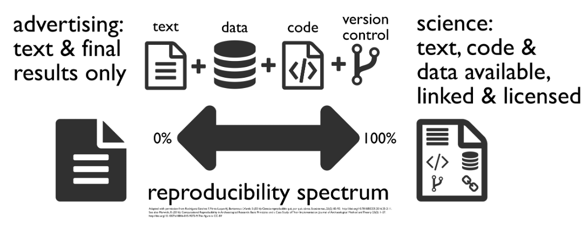
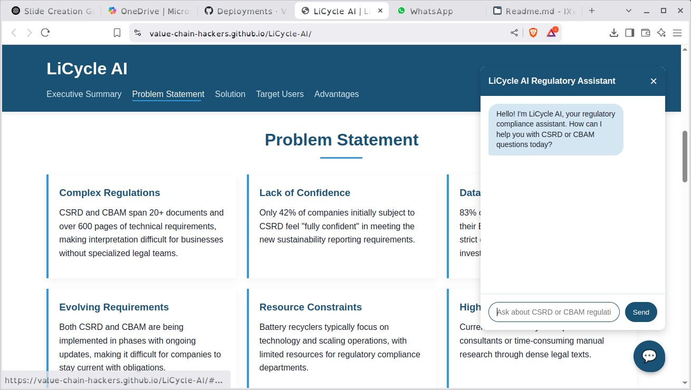

## Project Overview

::::: columns
::: {.column width="50%" style="font-size: 0.8em"}
<mark>📘 Lessons Learned:</mark>

-   Structure matters more than ambition
-   Constraints reveal priorities
-   Students need working AI-tools, not systems
-   Students need active support, not just a workshop
-   Failures teach if documented
-   Local infra works, but needs support
-   Collaboration drives progress
:::

::: {.column width="50%" style="font-size: 0.8em"}
<mark>🧠 Skills & What’s Working:</mark>

-   Full AI stack deployment (OpenWebUI, Qdrant, n8n)
-   Reproducible R workflows (RStudio, Docker)
-   Real-use workshops + mentorship
-   Proposal writing and stakeholder engagement
-   Active collaborations gaining traction
:::
:::::

------------------------------------------------------------------------

## Current Workstreams and Collaborations

::::: columns
::: {.column width="50%" style="font-size: 0.8em"}
<mark>🔧 Infrastructure:</mark>

-   VCH LLM stack (OpenWebUI, Qdrant, n8n)
-   DAT Linux for reproducible setups
-   Nextcloud for shared docs
-   RStudio workflows in progress

<mark>📚 Education & Workshops:</mark>

-   AI workshops based on real failures
-   Mentoring students with ready-to-use tools
-   Focus on prompting over building
-   Toward an AI learning track
:::

::: {.column width="50%" style="font-size: 0.8em"}
<mark>🌐 R&D:</mark>

-   Tool testing (Far.AI, AI Scientist)
-   R-based reproducibility pilots
-   Mapping AI for research workflows

<mark>🤝 Collaborations:</mark>

-   AgUnity (Clearroots) Stefan
-   Thomas Mazuiri (VCH-Infra),
-   Torsten Raudssus (Supplylens), Thomas Dik
-   SCF NICE (grant/pilot) Luka Westergeest
:::
:::::

------------------------------------------------------------------------

## Agenda – VCH Lab Update

::::: columns
::: {.column width="50%" style="font-size: 0.8em"}
1.  🧠 LLM Infrastructure for Students
2.  🛠️ General Tooling & Self-Hosted Stack
3.  🔁 Reproducible Research Environment
4.  🧪 Practical AI Workshops & Use Cases
5.  🚀 AI-Supported Student Projects
:::

::: {.column width="50%" style="font-size: 0.8em"}
1.  🌐 SupplyLens – Supply Chain Mapping Tool
2.  🧬 Experimental AI Tool Testing (Far.AI, AI Scientist)
3.  📲 ClearRoots – Compliance Platform (SCF NICE)
4.  📄 ClearPaper – Template Proposal (SCF NICE)
5.  🤝 Key Collaborations & Workstreams
:::
:::::

------------------------------------------------------------------------

## 1. VCH Infrastructure – LLM for Students

::::: columns
::: {.column width="50%" style="font-size: 0.8em"}
<mark>🎯 Goal:</mark>\
Enable students to use local LLMs for assignments, feedback, and learning.

<mark>🔒 Why:</mark>\
A local LLM stack enables:

-   Secure research with real data
-   No reliance on cloud services
-   Independent student experimentation

<mark>✅ Accomplished:</mark>

-   Running OpenWebUI-based LLM environment
-   Hosted on a local-controlled server
-   Integrated tools: Qdrant, n8n, pgvector, dashboards

<mark>🧠 Now Possible:</mark>

-   Memory-enabled AI workflows

More info:

-   VCH-Infra
:::

::: {.column width="50%" style="font-size: 0.8em"}
<mark>🚀 Next Steps:</mark>

-   Broader student adoption
-   Classroom integration
-   Real use case development

<mark>🆘 Help Needed:</mark>

-   Budget for <mark>TOKENS</mark> to run larger models
-   Personal costs are unsustainable
-   Need focused hours to maintain and improve
-   Requesting support and validation of direction
:::
:::::

------------------------------------------------------------------------

## 2. VCH Infrastructure – General Tools

::::: columns
::: {.column width="50%" style="font-size: 0.8em"}
<mark>🎯 Goal:</mark>\
Provide infrastructure with built-in tools so students can quickly ideate and prototype.

<mark>⚙️ Why:</mark>\
A seamless environment helps students move from ideas to experiments without technical barriers. <mark>✅ Accomplished:</mark>

-   AI stack fully deployed
-   Nextcloud environment live
-   DAT Linux system in full testing
:::

::: {.column width="50%" style="font-size: 0.8em"}
<mark>🚀 Next Steps:</mark>

-   Tighter integration of AI tools with DAT Linux
-   Enable AI features inside Nextcloud
-   Launch a documentation server using Nextcloud

<mark>🆘 Help Needed:</mark>

-   Hands-on testing of tools and flows
-   Feedback on missing functionality
-   Time to improve reliability
-   Support to validate that this is the right direction
:::
:::::

------------------------------------------------------------------------

## 3a. Reproducible Research – Infrastructure & Purpose

::::: columns
::: {.column width="50%" style="font-size: 0.8em"}
<mark>🎯 Goal:</mark>\
Enable researchers to build, test, and share repeatable experiments — data, code, and results.

<mark>🔍 Why:</mark>

-   Reproduce prior research
-   Run simulations
-   Build on each other’s work\
    AI is only useful in research when workflows are reproducible.

<mark>✅ Accomplished:</mark>

-   Stack deployable with DAT Linux, Docker, systemd
-   RStudio Server tested and running
:::

::: {.column width="50%" style="font-size: 0.8em"}
<mark>📎 More Info:</mark>\
[VCH-Datasharing GitHub](https://github.com/Value-Chain-Hackers/VCH-Datasharing)
:::
:::::

------------------------------------------------------------------------

## 3b. Reproducible Research – What's Next

::::: columns
::: {.column width="50%" style="font-size: 0.8em"}
<mark>🚀 Next Steps:</mark>

-   Build integrated workflows with RStudio
-   Apply data stewardship practices

<mark>🆘 Help Needed:</mark>

-   A real research case to reproduce
-   Time to document and test
-   Support and validation to proceed
:::

::: {.column width="50%"}

:::
:::::

------------------------------------------------------------------------

## 4a. Practical AI Use Cases & Workshops

::::: columns
::: {.column width="50%" style="font-size: 0.8em"}
<mark>🎯 Goal:</mark>\
Teach students how to use AI tools effectively — with a clear view of their limitations.

<mark>⚠️ Why:</mark>\
AI is overhyped. In reality:

-   Makes mistakes
-   Lacks reasoning & context
-   Struggles with memory & coherence\
    Students must learn to test and contain AI — not trust it blindly.

<mark>✅ Accomplished:</mark>

-   Workshop repo created
-   First sessions delivered
-   Failures (Knopenkoning, Inchainge) used as learning cases
:::

::: {.column width="50%" style="font-size: 0.8em"}
-   📚 Summarizing large volumes of literature
-   💡 Generating and refining hypotheses from data
-   🧹 Automating data cleaning and preprocessing
-   ✍️ Drafting sections of reports or papers
-   🧪 Running simulations or optimizing parameters
:::
:::::

------------------------------------------------------------------------

## 4b. Practical AI Workshops – Next Steps

::::: columns
::: {.column width="50%" style="font-size: 0.8em"}
<mark>🚀 Next Steps:</mark>

-   Translate IBM-based material into practice
-   Teach "data-to-reality" translation
-   Establish recurring feedback-driven workshops

<mark>🆘 Help Needed:</mark>

-   Integration & network engineers
-   Student testers
-   AI meetup facilitators
-   Co-builders for use case development
:::

::: {.column width="50%"}

:::
:::::

------------------------------------------------------------------------

## 5a. AI-Supported Student Projects

::::: columns
::: {.column width="50%"}
<mark>🎯 Goal:</mark>\
Support student-led projects by giving them AI tools that just work — not expecting them to build infrastructure.

<mark>💡 Why:</mark>\
As Maxime noted: most students can’t build their own AI pipelines.\
Instead, we:

-   Provide end-user-facing tools (not just chatbots)
-   Focus on prompting, saving, processing
-   Teach how to integrate internal and external tools
:::

::: {.column width="50%"}
<mark>🌐 Examples:</mark>

-   [VCH-Lithium](https://value-chain-hackers.github.io/LiCycle-AI/)
-   [VCH-BCM](https://github.com/Value-Chain-Hackers/LiCycle-AI)

<mark>✅ Accomplished:</mark>

-   Built 2 full AI-driven websites
-   Went beyond student-only capacity
-   Showed AI mentorship accelerates outcomes
:::
:::::

------------------------------------------------------------------------

## 5b. AI-Supported Student Projects – What’s Needed

::::: columns
::: {.column width="50%"}
<mark>🚀 Next Steps:</mark>

-   Showcase student outcomes
-   Build an AI mentorship track
-   Identify and guide new use cases

<mark>🆘 Help Needed:</mark>

-   Allow expert-student collaboration
-   Fund tokens for large models
-   Stop comparing local to OpenAI
-   Let trusted externals connect (e.g. Discord)
-   Formalize Value Chain Hackers: KvK, domain, mandate
-   Build a student team around AI dev
:::

::: {.column width="50%"}

:::
:::::

------------------------------------------------------------------------

## 6. SupplyLens (formerly Knopenkoning)

::::: columns
::: {.column width="50%"}
<mark>🎯 Goal:</mark>\
Map complex supply chains using AI, ESG data, and graph tech.

<mark>📌 Why:</mark>

-   CSRD/CSDDD compliance
-   Risk mapping & traceability
-   Real insight into supply chain complexity

<mark>⏳ Why Now:</mark>

-   Lessons learned (Sebastien)
-   New, realistic architecture
-   Community and AI support
:::

::: {.column width="50%"}
<mark>🚀 Next:</mark>

-   Approval to start
-   Time for focused dev
-   Scrum team permission

<mark>🆘 Needed:</mark>

-   OK to involve external contributors
-   Spin-off status (KvK, domain)
-   Small budget (\< €5K)
-   Space to test with externals
:::
:::::

------------------------------------------------------------------------

## 7. Experimental Tool Testing – AI Scientist, Far.AI

::::: columns
::: {.column width="50%"}
<mark>🔬 Goal:</mark>\
Explore cutting-edge AI tools for scientific workflows — like multi-step reasoning and automated research tasks.

<mark>🌐 Why:</mark>

-   Keep Windesheim on the frontier of AI
-   Explore tools that can:
    -   Simulate cyber attacks
    -   Generate PhD-level outputs
    -   Automate reasoning chains\
        These tools could reshape how research is done.
:::

::: {.column width="50%"}
<mark>🚀 Next Steps:</mark>

-   Test 3 tools for research potential
-   Document barriers & integration paths

<mark>🆘 Help Needed:</mark>

-   Budget for tokens to evaluate properly
-   Time to explore experimental edge cases
-   Space to collaborate with research teams

<mark>✅ Accomplished:</mark>

-   Reviewed AI Scientist & Far.AI
-   Identified promising capabilities
-   Repo bookmarked:
    -   GitHub – AI Scientist (aci)
:::
:::::

------------------------------------------------------------------------

## 8. Project Proposal – ClearRoots

::::: columns
::: {.column width="50%"}
<mark>🎯 Goal:</mark>\
Support smallholders and importers in complying with EU laws (CSRD, CSDDD, EUDR).

<mark>⚙️ How:</mark>

-   Mobile app collects local field data
-   Data stored via AgUnity blockchain
-   Auto-generates EU-compliant documents
-   Importers get ready-to-submit dossiers

<mark>📍 Status:</mark>

-   System logic + pilot flow drafted
-   Partners: AgUnity, Windesheim, SCF NICE
-   First pitch deck + 1-pager ready
:::

::: {.column width="50%"}
<mark>🌍 Why:</mark>

-   Smallholders lack tools
-   Importers lack clarity
-   Solves both without greenwashing

<mark>🆘 Needed:</mark>

-   Funding or co-dev support
-   Help writing grant proposal
-   Grant writer or funding partner
:::
:::::

::: notes
ClearRoots fills a legal-tech gap with real partners and real field logic. It’s ready to move — with the right support.
:::

------------------------------------------------------------------------

## 9. Project Proposal – ClearPaper

::::: columns
::: {.column width="50%"}
<mark>📄 Goal:</mark>\
Create standardized templates to help actors comply with EU laws (CSRD, CSDDD, EUDR).

<mark>🌍 Why:</mark>

-   No shared definition of "compliance"
-   Importers face uncertainty
-   Smallholders are excluded\
    ClearPaper bridges that gap.

<mark>📍 Status:</mark>

-   Legal mapping started (Windesheim, SCF NICE)
-   Concept aligned with ClearRoots
:::

::: {.column width="50%"}
<mark>🛠️ How:</mark>

-   Link templates to EU clauses
-   Formats: Word, LaTeX, JSON
-   Adaptable to national/language needs
-   Optional AgUnity integration

<mark>🆘 Needed:</mark>

-   Feedback to shape grant proposal
-   Help making it fundable
-   <mark>We need a grant writer</mark>
:::
:::::

------------------------------------------------------------------------

## Bi-Ronald: Automated Survey Reporting Platform

::::: columns
::: {.column width="50%"}
<mark>🎯 Purpose:</mark>\
Streamline survey workflows by automating response collection, analysis, and personalized report generation using open-source tools on self-hosted infrastructure.

<mark>🛠️ How It Works:</mark>

-   Participants complete a multi-step survey.
-   Responses are securely stored in a local database.
-   Automated workflows generate customized reports (PDF/HTML).
-   Reports are emailed to participants.
-   Data is prepared for structured analysis via dashboards or custom analytics.
:::

::: {.column width="50%"}
<mark>💡 Why It Matters:</mark>

-   Eliminates manual data processing and report generation.
-   Ensures data privacy by avoiding external cloud services.
-   Enhances efficiency in research and educational settings.

<mark>🔗 Repository:</mark>

-   GitHub – Bi-Ronald
:::
:::::

::: notes
Bi-Ronald offers a scalable solution for automating survey processes, providing immediate, personalized feedback to participants while maintaining data control and privacy.
:::

------------------------------------------------------------------------

## 11. Key Collaborations

-   Thomas Dik – AI tooling and cloud architecture
-   Ronald de Boer – Business Intelligence, Power BI integration
-   Luka Westgeest – SCF, ClearRoots & ClearPaper
-   Stefan Barrett (AG-Unity CTO) – Document processing logic
-   Iivo Salmi & Raul Raus – Trusted EU infrastructure research - Finland.
